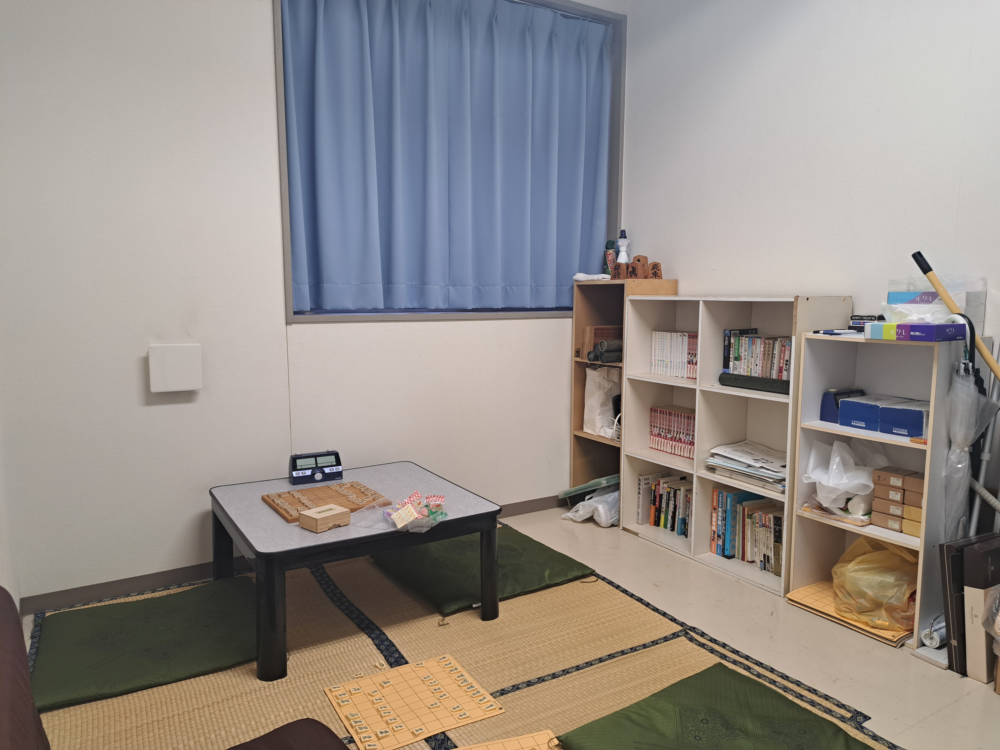
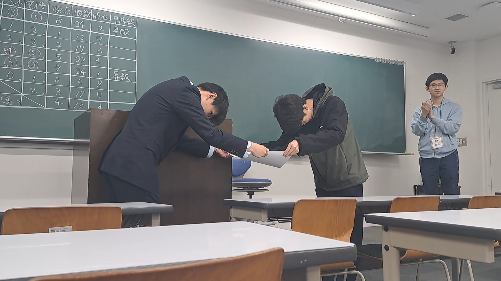

# 活動紹介
---
## 日頃の活動
 
毎週金曜日に活動しています。 
部室には棋書・盤駒・チェスクロック等、将棋のための設備が整っています。
  

## 大会・部内戦・レーティング
 
一年を通して、さまざまな大会・部内戦があります。 
大会は全国大会がかかるものから大学間交流を目的としてものまで多数あります。主に日曜日が開催日です。 
一方、部内戦(順位戦)は1~3か月かけて行います。
  